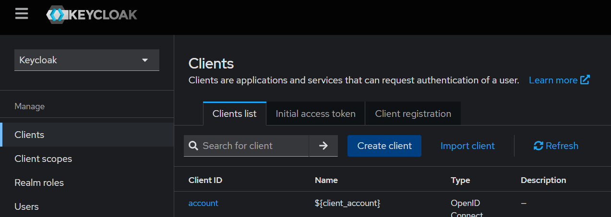
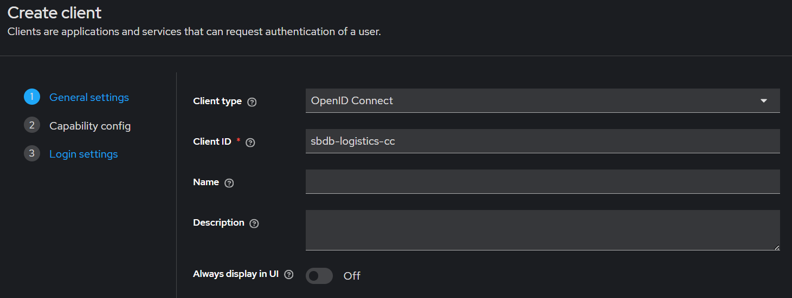
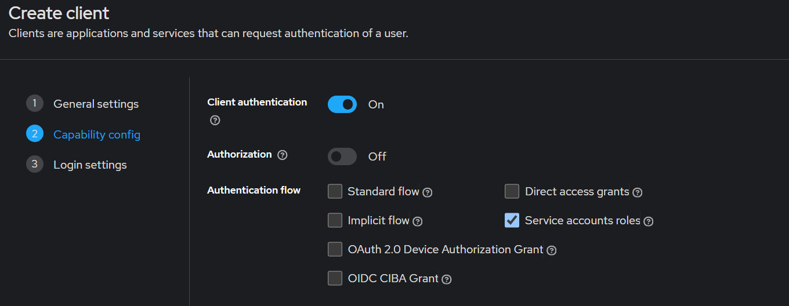
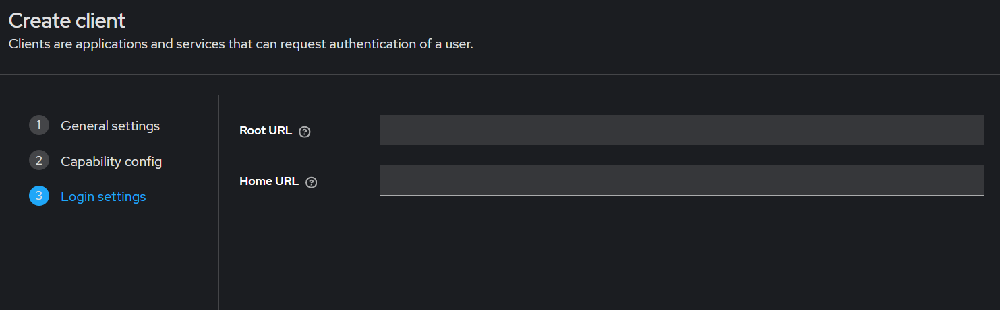
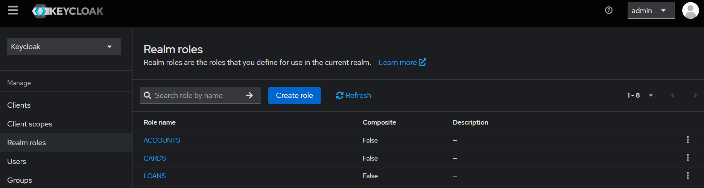
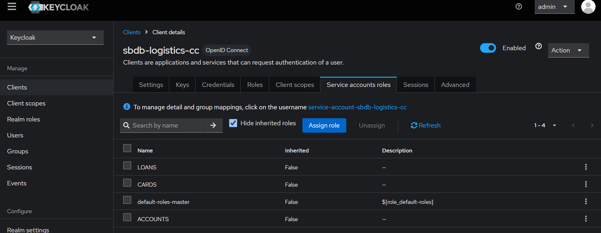
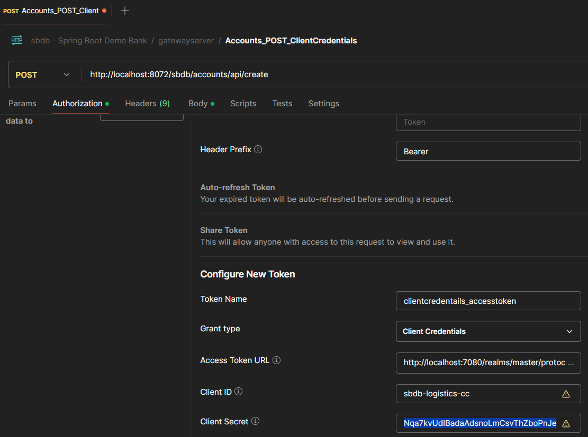
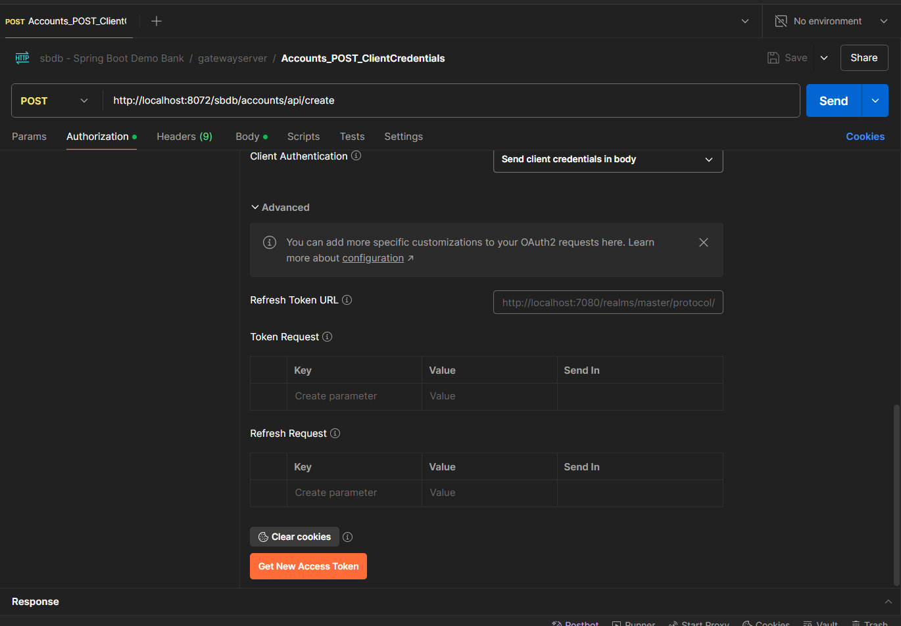
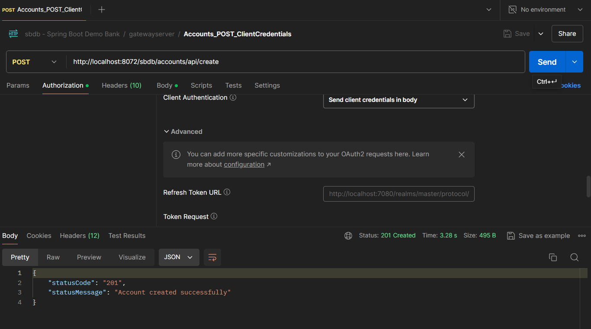

# Spring Boot Demo Bank - App 
- Repo: sbdb-app
  
Project pattern using the 12-Factor Methodology.

---

## Get started

You will need:
- Acess to the private repository of sbdb (sbdb-private), to get access to the enviroment variables. This will be change in a future release;
- Docker;
- Java 17;
- Maven;
- Postman, for tests.

First, go to the docker folder and run the .bat builder file. This will create the image container of the microservices:
```
cd .\docker\
.\dockerBuild.bat
```

After, go to the docker-compose folder and run the containers, like:
```
cd .\docker\default\
docker compose up -d
```

If you want to up in debug mode, you will need to start the databases and the rabbitmq containers:
```
cd .\docker\external-only\
docker compose up -d
```

## Configuration
Once the containers are ready, you will need to access the keycloak page at http://localhost:7080/ with the admin user to start the security configuration:
```
username: admin
password: admin
```

Next, you will need to create a new client for the OAuth2 pattern. See the steps below.

*For more details, see the Keycloak documentation.*

1. On the home page, go to Client > Create client;


2. Enter the Client ID (refer to OAuth2 specifications);


3. Use the default capability configuration;


4. Leave the login settings empty;


5. You also need to create the three roles required for the project in Keycloak;


6. And assign them to the clients;


To start making requests using a client, you will need to build the OAuth2 client pattern for the request using the Client ID and Client Secret. See the steps below:

1. In Postman, create the OAuth2 token using the client information;


2. Then, scroll down the page and click "Get New Access Token" and "Use this token" on the next open page;   


3. Once the token is in use, you can make authenticated requests;


## Security

IAM (Identity & Access Management) strategy for security:
- Authorization: OAuth2 patterns (access management);
- Authentication: OpenID Connect protocol (identity);
For this project, Keycloak is the tool being used because it is a mature solution. However, it may be replaced in the future by the new Spring Security Authentication Server when it becomes more reliable.

## TODO:

- The endpoint documentation will be commited in a future release.
- This project is under development, so the documentation and this README are being improved over time.
